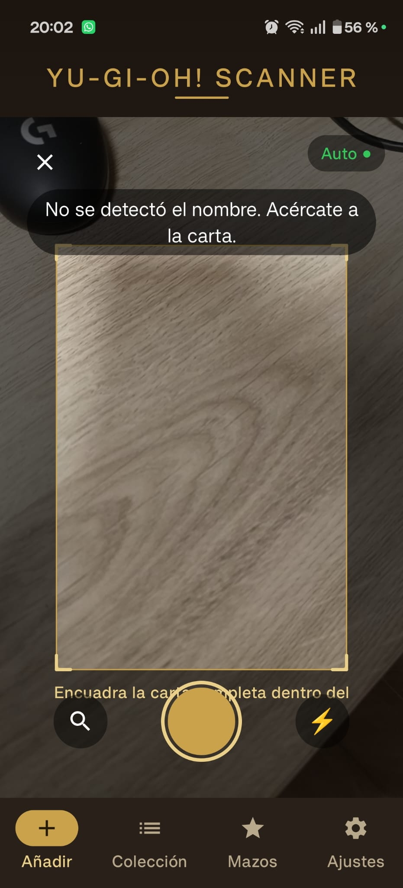
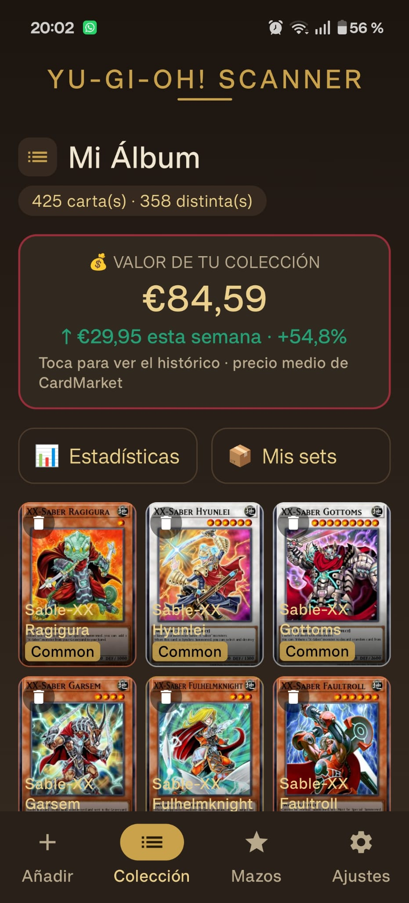
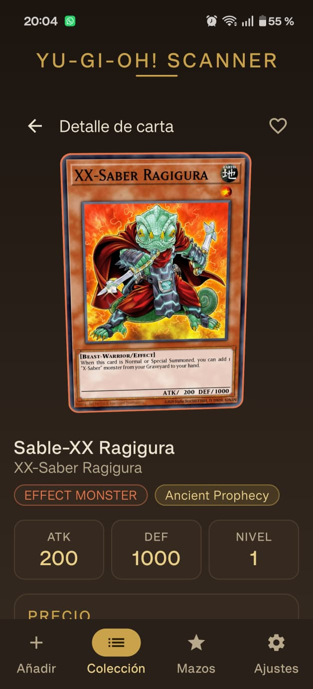

# 🃏 Yu-Gi-Oh! Card Scanner

**Escanea, colecciona y arma mazos de Yu-Gi-Oh! desde tu móvil — 100 % sin conexión.**

App Android nativa (Kotlin + Jetpack Compose) que identifica cartas con la cámara y las
guarda en un álbum digital. Todo el catálogo viaja dentro de la app, así que funciona
**offline**: sin servidor, sin depender de ninguna API en tiempo de ejecución.


---

## ✨ Características

### 📷 Escaneo inteligente
- **Detección de la carta** en tiempo real con CameraX + OpenCV (recorte y corrección de perspectiva).
- Identificación en cascada, de más a menos fiable:
  1. **Passcode** (los 8 dígitos de la esquina) leído por OCR → coincidencia exacta.
  2. **Huella visual (pHash)** contra el catálogo si el passcode no se lee.
  3. **Nombre por OCR** como último respaldo, con búsqueda difusa tolerante a erratas.
- Aviso emergente al guardar (nueva / duplicada) con opción de **deshacer**.

### 📚 Colección
- Álbum con varias copias por carta, **condición**, **rareza**, **favoritos** y **selección de arte**.
- Chips de estado (p. ej. **«EN MAZO»** para las cartas que ya usas en algún mazo).
- **Álbum por sets** con porcentaje de completado y **estadísticas** de la colección.
- **Valor de la colección** (precio medio de CardMarket) con **tendencia** e **histórico** por día.

### 🛠️ Constructor de mazos
- Reglas reales del juego: Deck Principal 40–60, Extra ≤ 15, máx. 3 copias.
- **Ban list (Forbidden & Limited)** del TCG: bloquea prohibidas y avisa de excesos; veredicto de legalidad.
- **Sugerencias por arquetipo** con criterio *meta* (heurística offline): tarjeta destacada + carrusel comparativo.
- Exportar/compartir la lista del mazo.

### ☁️ Extras
- **Login con Google opcional** (Firebase) solo para **copia de seguridad / restauración** en la nube.
- **Actualización del catálogo sin republicar** la app (GitHub Action semanal + descarga desde Ajustes).
- Tema visual «binder cálido» (cuero, pergamino y oro envejecido).

---

## 📷 Capturas

> 🚧 _Capturas pendientes._ Se añadirán más adelante. Guía de nombres en [`docs/capturas/`](docs/capturas/).

<!--
  GALERÍA LISTA PARA ACTIVAR:
  1) Coloca las imágenes en docs/capturas/ con estos nombres.
  2) Quita esta línea de comentario de apertura y la de cierre del final del bloque.

<table>
  <tr>
    <td align="center"><br><sub>Bienvenida</sub></td>
    <td align="center"><br><sub>Escáner</sub></td>
    <td align="center"><br><sub>Colección</sub></td>
  </tr>
  <tr>
    <td align="center"><br><sub>Detalle de carta</sub></td>
    <td align="center"><br><sub>Sugerencias de mazo</sub></td>
    <td align="center"><br><sub>Valor de la colección</sub></td>
  </tr>
</table>

-->

---

## 🏗️ Arquitectura

Diseño **offline-first** con separación clara de responsabilidades (MVVM + capa Repository):

- **Dos bases de datos Room independientes:**
  - `catalog.db` — **solo lectura**, empaquetada en `assets/` (más de 14.000 cartas de [YGOPRODeck](https://ygoprodeck.com/api-guide/)).
  - `user.db` — datos del usuario (colección, mazos, histórico de valor), sincronizable con Firebase.
- **Sin backend en runtime:** las búsquedas y precios se resuelven en local. Retrofit/PostgreSQL solo se usan
  en *build-time* para **generar** el catálogo empaquetado.
- La búsqueda difusa combina candidatos + ranking por similitud (Levenshtein / Jaro-Winkler) en Kotlin.

Detalle completo en [`docs/ARQUITECTURA.md`](docs/ARQUITECTURA.md).

---

## 🧰 Tecnologías

| Área | Tecnología |
|---|---|
| Lenguaje | Kotlin 2.1.0 |
| UI | Jetpack Compose (Material 3) |
| Persistencia | Room 2.7 (+ KSP) |
| Cámara | CameraX |
| OCR | ML Kit Text Recognition |
| Visión | OpenCV (detección/recorte de la carta) |
| Imágenes | Coil |
| Nube (opcional) | Firebase Auth + Firestore |
| Build | Gradle (AGP 9.x), catálogo de versiones |

**Objetivo:** `compileSdk 35` · `minSdk 26` · Java 11.

---

## 🚀 Compilar y ejecutar

**Requisitos:** Android Studio reciente (con su JDK incluido) y el SDK de Android 35.

```bash
git clone https://github.com/ernestogba3/yugioh-card-scanner.git
```

1. Abre el proyecto en **Android Studio** y espera al *Gradle Sync*.
2. Conecta un dispositivo o emulador (**Android 8.0 / API 26** o superior).
3. Pulsa **Run** (▶). En el primer arranque, el catálogo se importa a Room automáticamente.

Compilar desde terminal (opcional):

```bash
# En Windows, apunta JAVA_HOME al JDK de Android Studio:
export JAVA_HOME="C:/Program Files/Android/Android Studio/jbr"
./gradlew assembleDebug
```

> **Firebase es opcional.** La app compila y funciona sin `google-services.json`; el login de Google y
> la copia de seguridad solo se activan si añades tu propio archivo de configuración.

---

## 📁 Estructura del proyecto

```
EscanerCartasYuGiOh/
├── app/                  # App Android (Kotlin + Compose)
│   └── src/main/java/com/example/yugiohscanner/
│       ├── data/         # Room (catálogo + usuario), escaneo, búsqueda, repositorios
│       └── ui/           # Pantallas, componentes, ViewModels, tema
├── backend/              # Generador del catálogo (Node.js, solo build-time)
├── docs/                 # 📚 Toda la documentación (empieza por INDICE.md)
└── .github/workflows/    # Action que actualiza el catálogo
```

---

## 📚 Documentación

Todo está centralizado en la carpeta [`docs/`](docs/) — empieza por el índice:

| Documento | Contenido |
|---|---|
| [docs/INDICE.md](docs/INDICE.md) | Puerta de entrada a toda la documentación |
| [docs/ARQUITECTURA.md](docs/ARQUITECTURA.md) | Arquitectura offline-first en detalle |
| [docs/ROADMAP.md](docs/ROADMAP.md) | Estado del proyecto por fases |
| [docs/ACTUALIZACION_CATALOGO.md](docs/ACTUALIZACION_CATALOGO.md) | Cómo se refresca el catálogo sin republicar |

---

## 🙏 Créditos y aviso legal

- Datos e imágenes de las cartas: **[YGOPRODeck API](https://ygoprodeck.com/api-guide/)**.
- *Yu-Gi-Oh!* es una marca registrada de **Konami**. Este es un proyecto **no oficial, sin ánimo de lucro
  y con fines educativos** (parte de un curso de programación 2026), sin ninguna afiliación con Konami.

---

## 📄 Licencia

El **código** de este proyecto se publica bajo la licencia **[MIT](LICENSE)**.

> La licencia MIT cubre únicamente el código fuente. Los **datos e imágenes de las cartas** pertenecen a
> sus respectivos titulares (YGOPRODeck / Konami) y quedan fuera de esta licencia.

---

<p align="center"><i>Hecho con ❤️ y Kotlin para coleccionistas.</i></p>
